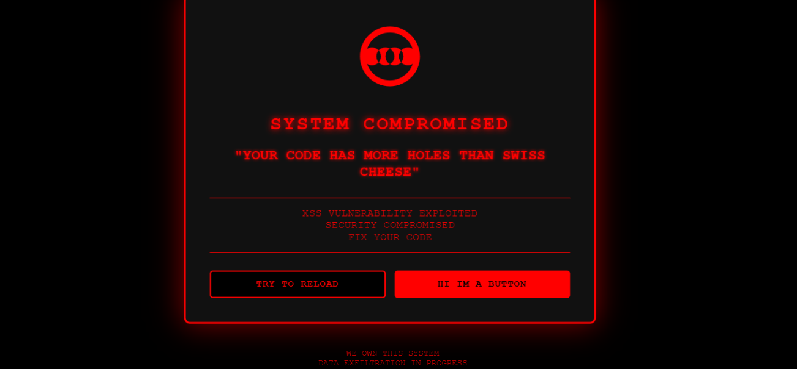

```markdown
# XSS!FY

## Overview

XSS!FY is a professional security assessment tool designed for detecting and testing Cross-Site Scripting (XSS) vulnerabilities in web applications. The framework provides automated vulnerability discovery, payload testing, and script injection capabilities with a comprehensive reporting system.

## Features

### Core Capabilities

- **Automated Vulnerability Discovery**: Scans HTML forms, URL parameters, API endpoints, JSON endpoints, and WebSocket connections
- **Extensive Payload Library**: Tests over 70 different XSS payloads including:
  - Basic vectors (script tags, event handlers, iframes)
  - Alternative syntax variations
  - Encoding bypass techniques
  - Template injection patterns
  - DOM-based XSS vectors
  - CSS-based injection methods
  - Bypass and obfuscation techniques

- **Multi-threaded Scanning**: Concurrent testing across multiple injection points for faster results
- **Stored XSS Detection**: Identifies forms and endpoints likely to persist malicious payloads
- **Risk Assessment**: Automatically categorizes vulnerabilities by danger level (CRITICAL, HIGH, MEDIUM, LOW)
- **Custom Script Injection**: Supports loading and injecting custom JavaScript payloads from external files
- **Interactive CLI Interface**: User-friendly terminal interface with formatted tables and color-coded output
- **Web Dashboard**: Flask-based web interface for remote scanning and management

### Vulnerability Detection

The scanner identifies injection points through:

- HTML form analysis (inputs, textareas, select elements)
- URL query parameter extraction
- JavaScript API endpoint discovery
- JSON endpoint detection
- WebSocket connection identification
- Form method detection (GET/POST)

### Reflection Type Analysis

Detected vulnerabilities are classified by reflection behavior:

- **DIRECT**: Payload appears unmodified in response
- **ENCODED**: Payload is HTML-encoded in response
- **PARTIAL**: Fragments of payload appear in response
- **CASE_INSENSITIVE**: Payload appears with case variations

## Installation

### Prerequisites

```bash
pip install requests beautifulsoup4 flask colorama
```

### Dependencies

- requests - HTTP library
- beautifulsoup4 - HTML parsing
- flask - Web interface
- colorama - Terminal color output
- urllib.parse - URL manipulation
- threading - Concurrent execution
- concurrent.futures - Thread pool management

## Usage

### Command Line Interface

```bash
python xssify.py
```

### Basic Scanning

```python
from xssify import XSSifyScanner

scanner = XSSifyScanner("https://target-website.com")
vulnerabilities = scanner.scan_for_vulnerabilities()
```

### Interactive Mode

```python
scanner = XSSifyScanner("https://target-website.com")
scanner.interactive_mode()
```

The interactive mode provides:

1. Script library selection
2. Custom script injection
3. Vulnerability details viewer
4. Target rescanning
5. Exit option

### Custom Script Library

Place JavaScript files in the `Injection-Scripts/` directory. The scanner automatically loads all `.js` files and makes them available for injection.

Example structure:
```
Injection-Scripts/
├── cookie_stealer.js
├── keylogger.js
├── backdoor.js
└── custom_payload.js
```

## Vulnerability Report Format

Results include:

- **Type**: Injection point type (FORM, URL_PARAMS, API_ENDPOINT, JSON_ENDPOINT)
- **Danger Level**: Risk assessment (CRITICAL, HIGH, MEDIUM, LOW)
- **Stored**: Whether the vulnerability persists (stored XSS)
- **Reflection Type**: How the payload appears in response
- **Impact**: Potential severity of exploitation
- **URL**: Vulnerable endpoint location

## Risk Assessment Methodology

### Danger Levels

- **CRITICAL**: Login forms, authentication endpoints, payment forms, account management
- **HIGH**: Storage forms (comments, posts, profiles), API endpoints, WebSocket connections
- **MEDIUM**: Standard input fields, URL parameters
- **LOW**: Non-critical input points

### Impact Calculation

- **HIGH**: Stored XSS, critical forms, authentication pages
- **MEDIUM**: Reflected XSS in standard forms

## Screenshots

### Scan Results 1


### Scan Results 2


### Scan Results 3


## Technical Details

### Session Management

- Maintains persistent HTTP session for cookie handling
- Custom User-Agent headers for realistic browser simulation
- Full header configuration for modern web application compatibility

### Payload Testing

The scanner tests each injection point against the complete payload library using concurrent execution. Successful injections are verified through:

- Exact string matching
- HTML entity encoding detection
- Partial payload reflection
- Case-insensitive matching

### Threading Configuration

Default: 10 concurrent workers (configurable via `max_workers` parameter)

```python
scanner.scan_for_vulnerabilities(max_workers=20)
```

## Output Features

- Dynamic terminal width adaptation
- Color-coded severity indicators
- Formatted ASCII tables with box-drawing characters
- Scan summary statistics
- Centered banners and headers

## Limitations

- Requires target website to be accessible
- Cannot bypass CAPTCHA or advanced bot protection
- May trigger WAF/IDS systems
- Limited to HTTP/HTTPS protocols for most features
- WebSocket testing is discovery-only

## Legal Disclaimer

This tool is designed for authorized security testing only. Users must obtain explicit permission before scanning any web application. Unauthorized testing may violate computer fraud and abuse laws. The authors assume no liability for misuse of this software.

## Use Cases

- Penetration testing engagements
- Security audits
- Web application security assessments
- Vulnerability research
- Educational purposes in controlled environments

## Configuration

### Custom Headers

Modify the `headers` dictionary in the `__init__` method to customize HTTP headers.

### Timeout Settings

Default timeout: 15 seconds for discovery, 10 seconds for payload testing

### Scripts Directory

Default: `Injection-Scripts/` (automatically created if not present)

## Future Enhancements

Potential improvements for future versions:

- DOM-based XSS detection
- Blind XSS testing with callback server
- WAF detection and bypass techniques
- Export reports (JSON, HTML, PDF)
- Browser automation for dynamic content
- Authenticated scanning support

## Author
S-K1DD13
Security research tool for professional use only. Don't be stupid.

## Version

Current Version: 1.0
```
