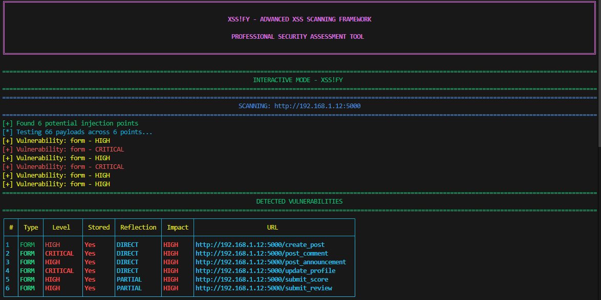
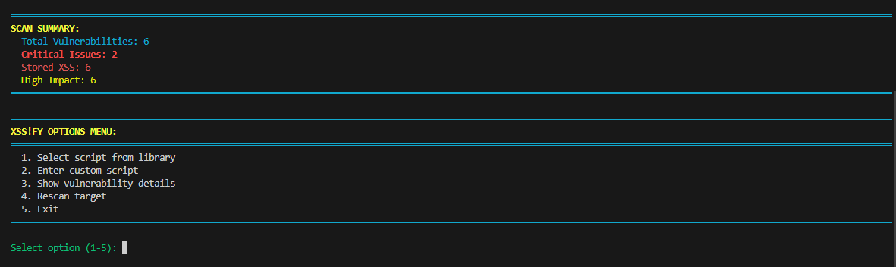

# XSS!FY

## Overview

XSS!FY finds XSS. Simple. Fast. Built for people who actually test stuff. It scans sites, injects payloads, and tells you what’s dangerous. Not a toy.

## Features

### Core Capabilities

* Automated scans of forms, URL params, API and JSON endpoints, plus WebSocket discovery
* 70+ XSS payloads: script tags, event handlers, iframes, encodings, template tricks, DOM vectors, CSS injections, obfuscation and bypass stuff
* Multi-threaded scanning for speed
* Stored XSS detection (it spots stuff that sticks)
* Risk categorization: CRITICAL, HIGH, MEDIUM, LOW
* Load your own JS payloads from files
* Interactive CLI with tables and colored output
* Optional web dashboard (Flask) for remote control

### Detection methods

Finds injection points via:

* HTML forms (inputs, textareas, selects)
* URL query params
* JS API endpoints and JSON responses
* WebSocket endpoints
* Form method detection (GET/POST)

### Reflection types

* DIRECT: payload shows up unchanged
* ENCODED: HTML encoded in response
* PARTIAL: just bits of the payload show up
* CASE_INSENSITIVE: payload appears with case changes

## Install

### Requirements

* Python 3.7+
* pip
* Internet for deps

### Quick start

```bash
git clone https://github.com/Lynch9274927482/XSSify.git
cd XSSify
```

If you prefer manual:

```bash
pip install -r requirements.txt
# or
pip install requests beautifulsoup4 flask colorama lxml
```

Verify:

```bash
python -c "import requests, bs4, flask, colorama; print('All dependencies installed successfully!')"
```

Run:

```bash
python xssify.py
```

### OS notes

Linux/Ubuntu

```bash
sudo apt update
sudo apt install python3 python3-pip git
git clone https://github.com/Lynch9274927482/XSSify.git
cd XSSify
python3 install.py
```

Windows

```bash
git clone https://github.com/Lynch9274927482/XSSify.git
cd XSSify
python install.py
```

macOS

```bash
brew install python3 git
git clone https://github.com/Lynch9274927482/XSSify.git
cd XSSify
python3 install.py
```

### Troubleshooting

pip not found

```bash
# Linux/macOS
sudo apt install python3-pip
# macOS alternative
brew install python3
# Windows
python -m ensurepip --upgrade
```

Permission denied

```bash
pip install --user -r requirements.txt
# or use venv
python3 -m venv venv
source venv/bin/activate  # Linux/macOS
venv\Scripts\activate     # Windows
pip install -r requirements.txt
```

SSL errors

```bash
pip install --trusted-host pypi.org --trusted-host files.pythonhosted.org -r requirements.txt
```

### Virtual env (recommended)

```bash
python3 -m venv xssify-env
source xssify-env/bin/activate  # Linux/macOS
xssify-env\Scripts\activate     # Windows
pip install -r requirements.txt
python xssify.py
deactivate
```

## Dependencies

* requests
* beautifulsoup4
* flask (optional, web UI)
* colorama
* lxml
* urllib.parse, threading, concurrent.futures

## Usage

CLI:

```bash
python xssify.py
```

As a module:

```python
from xssify import XSSifyScanner
scanner = XSSifyScanner("https://target-website.com")
vulns = scanner.scan_for_vulnerabilities()
```

Interactive mode:

```python
scanner = XSSifyScanner("https://target-website.com")
scanner.interactive_mode()
```

Features: choose payloads, inject custom scripts, view vuln details, rescan.

### Custom scripts

Drop .js files in `Injection-Scripts/`. They load automatically.

Example:

```
Injection-Scripts/
├── cookie_stealer.js
├── keylogger.js
└── custom_payload.js
```

## Report format

Reports include:

* Type: FORM, URL_PARAMS, API_ENDPOINT, JSON_ENDPOINT
* Danger Level: CRITICAL, HIGH, MEDIUM, LOW
* Stored: yes/no
* Reflection Type: DIRECT, ENCODED, PARTIAL, CASE_INSENSITIVE
* Impact: short explanation
* URL: endpoint

## Risk rules

* CRITICAL: login, auth, payment, account mgmt
* HIGH: storage endpoints, APIs, WebSockets
* MEDIUM: reflected XSS in normal inputs
* LOW: minor input points

Impact is higher for stored XSS and auth-related pages.

## Screenshots

Startup examples:



## Included scripts

kitty.js (harmless)


mock.js (harmful example)


## Tech details

* Persistent HTTP sessions and cookie handling
* Custom User-Agent and headers to mimic browsers
* Tests payloads concurrently and verifies via exact match, HTML entity detection, partial reflection, and case-insensitive checks

Threading default: 10 workers. Example override:

```python
scanner.scan_for_vulnerabilities(max_workers=20)
```

## Output

* Adapts to terminal width
* Color-coded severity
* ASCII tables
* Summary stats and centered banners

## Limits

* Needs target reachable
* Won't bypass CAPTCHA or advanced bot protection
* May trigger WAF/IDS
* Mostly HTTP/HTTPS; WebSocket testing is discovery-only

## Legal

Only scan targets you have explicit permission to test. Unauthorized testing is illegal. Authors not liable for misuse.

## Use cases

* Pentests
* Security audits
* Research and learning in safe environments

## Config

* Custom headers: edit `headers` in `__init__`
* Timeouts: discovery 15s, payloads 10s (defaults)
* Scripts dir: `Injection-Scripts/` created automatically

## Roadmap

Planned:

* Better DOM XSS detection
* Blind XSS callbacks
* WAF detection and bypass ideas
* Export to JSON, HTML, PDF
* Browser automation for dynamic content
* Authenticated scans

## Author

S-K1DD13

Security research tool. Don’t be stupid.

## Version

1.0
